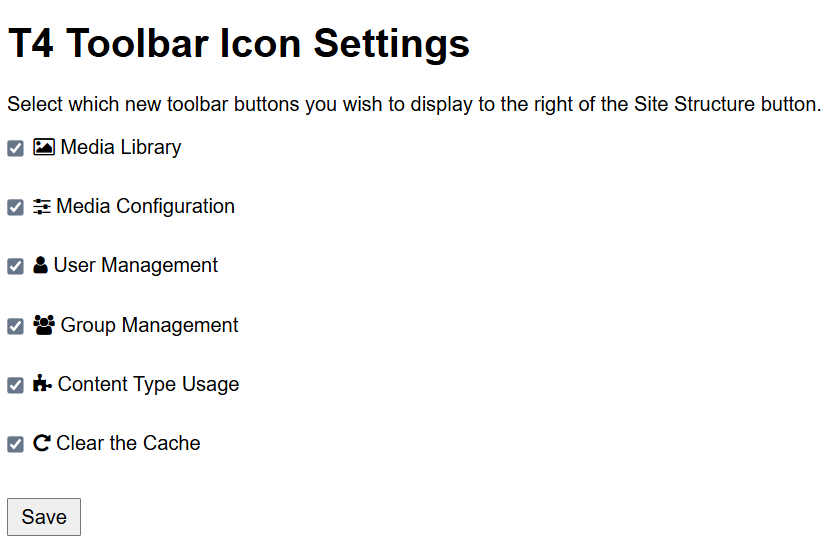
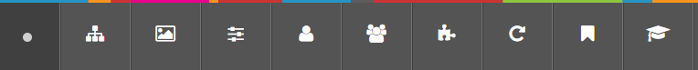

# 🧩 T4 Add Toolbar Buttons (Firefox edition)

This Firefox add-on adds extra buttons to the Terminalfour (T4 v8) toolbar, just to the right of the Site Structure icon. These buttons link directly to useful features such as the **Media Library**, helping web editors work faster and more efficiently.

---

## 🚀 Features

- Adds new buttons to the T4 toolbar to the right of the Site Structure button.
- Future-ready: more buttons can be added and toggled via the options panel.
- Simple, fast, unobtrusive.

---

## ✅ Compatible browsers

This extension has been tested successfully in the following Gecko-based browsers on Windows 11:

- [Mozilla Firefox](https://www.firefox.com/)
- [Mozilla Firefox Developer Edition](https://www.firefox.com/en-GB/channel/desktop/developer/)

A [Chrome/Chromium-compatible version is available](https://github.com/garethjmsaunders/t4-add-toolbar-buttons-chrome).

---

## 🖥️ How to use

1. **Install the extension** (see below)
2. Open Terminalfour (T4) as usual.
3. Look for new toolbar buttons next to the Site Structure icon.
4. Click any added button to open the corresponding section in T4.

---

## 📦 How to install

1. Download the zip file from GitHub. (Click the green `<> Code` button and select Download ZIP.)
2. Unzip the extension files.
3. You just need the `t4-add-toolbar-buttons-firefox-1.10.1.xpi` file. (An `XPI` file is a special zip file that has been signed by Mozilla for distributing add-ons.)
4. Open your browser and visit `about:addons`.
5. Select the ⚙️ cog icon (top right).
6. Select **Install Add-on From File...**.
7. Select your unzipped `XPI` file.
8. Select **Open**.
9. A dialog box will appear with details about the add-on. If you want to allow the extension to run in private windows, click the checkbox.
10. Select **Add**.
11. Another dialog box will appear. Check the box to pin the extension to the toolbar.
12. Select **OK**.
13. The toolbar button should now appear on your browser toolbar.

---

## ⚙️ Configure your toolbar buttons

You can choose which buttons appear by visiting the extension’s **Options panel**.

1. Right-click the T4 add-on icon on the toolbar.
2. Select **Manage Extension**.
3. Select the three-horizontal-dots (**...**).
4. Select **Options**.
5. Select which toolbar buttons you wish to show.
6. Select **Save**.

> 💡 Changes take effect immediately — just refresh your T4 browser tab.

---

## 🧪 Available toolbar buttons

You can choose which of these buttons appear in the T4 toolbar by using the extension’s options panel:

- 🖼️ **Media Library** – Go to the Media Library
- ⚙️ **Media Configuration** – Go to the Media Configuration (`mediaconfig#types`)
- 👤 **User Management** – Manage user accounts in T4
- 👥 **Group Management** – Manage user groups in T4
- 🧩 **Content Type Usage** – See which content types are in use
- 🔁 **Clear the Cache** – Rebuild the T4 Cache

> Use the **Options panel** to enable or disable individual buttons.